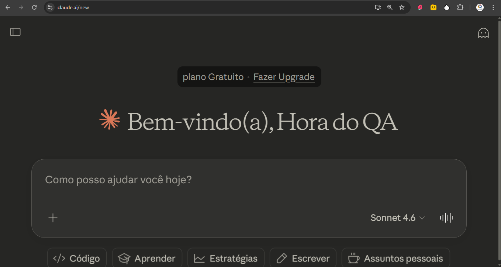

# 🤖 O que é o Claude.ai?

Claude.ai é a interface conversacional desenvolvida pela Anthropic, empresa pioneira em segurança de IA. Disponível via web, mobile e desktop, o Claude é um assistente de inteligência artificial de última geração projetado para ser útil, inofensivo e honesto — capaz de raciocinar profundamente, escrever, analisar, programar e muito mais.

A plataforma oferece planos para diferentes perfis: desde uso pessoal até equipes e empresas, com recursos como memória de conversas, pesquisa na web, execução de código e integração com ferramentas externas.

Acesse a [Claude](https://calude.ai) !

## 🧪 Como o Claude.ai pode ajudar na Qualidade de Software?

A área de **Quality Assurance (QA)** envolve processos complexos, documentação extensa e análise técnica — exatamente onde o Claude brilha. Veja as principais aplicações:

---

### 📋 Planejamento e Documentação de Testes

- Criação de **Planos de Teste** completos (Test Plans) com escopo, critérios de entrada/saída e estratégias
- Elaboração de **casos de teste** detalhados a partir de requisitos ou histórias de usuário
- Geração de **checklists de regressão** e matrizes de rastreabilidade

---

### 🔍 Análise de Requisitos e Riscos

- Identificação de **ambiguidades e lacunas** em requisitos funcionais
- Mapeamento de **riscos de qualidade** e pontos críticos do sistema
- Sugestão de **critérios de aceite** para user stories

---

### 💻 Automação de Testes

- Escrita de scripts em frameworks como **Selenium, Cypress, Playwright, Robot Framework e Pytest**
- Geração de **dados de teste** realistas e edge cases
- Revisão e refatoração de código de teste existente
- Criação de **mocks e stubs** para testes unitários e de integração

---

### 🐛 Análise e Rastreamento de Bugs

- Apoio na redação de **relatórios de bug** claros e padronizados
- Análise de **logs de erro** e stack traces para identificar causas raiz
- Classificação de defeitos por **severidade e prioridade**

---

### 📊 Processos e Métricas de Qualidade

- Explicação e aplicação de **métricas de qualidade** (cobertura de código, taxa de defeitos, MTTR, etc.)
- Suporte em **processos ágeis de QA** (Definition of Done, sprint reviews, retrospectivas)
- Apoio na implementação de **pipelines CI/CD** com foco em qualidade

---

### 🎓 Aprendizado e Capacitação

- Explicações didáticas sobre **técnicas de teste** (caixa preta, caixa branca, testes exploratórios, etc.)
- Estudo de **normas e padrões** como ISO 25010, ISTQB e IEEE 829
- Preparação para **certificações de QA** com exercícios e simulados

---

## ✨ Por que usar o Claude.ai no seu fluxo de QA?

| Benefício | Impacto |
|---|---|
| Velocidade | Gera casos de teste em segundos |
| Consistência | Padroniza documentação de testes |
| Cobertura | Sugere cenários que podem passar despercebidos |
| Aprendizado | Explica conceitos técnicos de forma clara |
| Integração | Trabalha com suas ferramentas e linguagens preferidas |

---

O **Claude.ai** não substitui o profissional de QA — ele o **potencializa**, permitindo que o time foque no que realmente importa: garantir a entrega de software com excelência. 🚀

