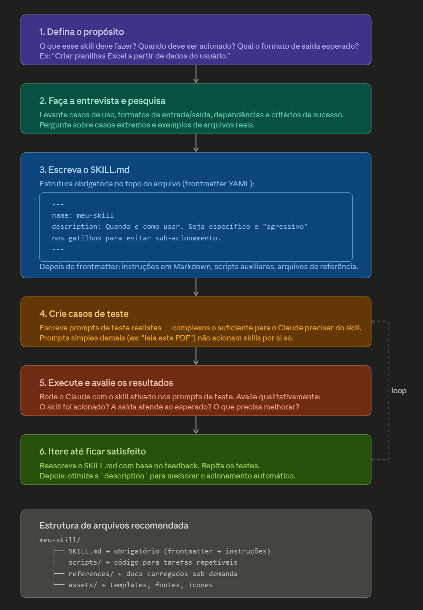

# Guia de Skills no Claude

> Um guia prático para quem quer aprender a criar e usar Skills no Claude, baseado em perguntas e respostas reais.

---

## O que é um Skill?

Um **Skill** é um arquivo de instruções que ensina o Claude a executar tarefas específicas de forma padronizada e reutilizável.

Pense assim: o Claude já sabe fazer muitas coisas por padrão, mas um Skill é como um "manual de procedimentos" que você entrega a ele antes de começar o trabalho. Com esse manual em mãos, ele segue etapas específicas, usa as ferramentas certas e produz saídas no formato que você definiu — de forma consistente, toda vez.

### Como funciona na prática

O Claude tem acesso a uma lista de Skills disponíveis. Cada Skill aparece com seu `name` e `description`. Quando você faz uma pergunta ou pedido, o Claude decide se algum Skill é relevante para aquela tarefa e, se for, lê o `SKILL.md` completo antes de responder.

É um sistema de três camadas:

- **Metadados** (`name` + `description`) — sempre visíveis, usados para decidir se o Skill deve ser acionado.
- **Corpo do SKILL.md** — lido quando o Skill é acionado, contém as instruções detalhadas.
- **Recursos bundled** (`scripts/`, `references/`, `assets/`) — carregados sob demanda conforme as instruções indicam.

### Para que serve na prática

Skills são úteis quando você tem um fluxo de trabalho recorrente e quer que o Claude sempre o execute da mesma forma. Exemplos comuns: criar planilhas com uma estrutura específica, gerar documentos Word com formatação corporativa, ler PDFs seguindo um roteiro de extração, ou criar apresentações com um estilo visual definido.

Sem um Skill, o Claude improvisa a abordagem a cada vez. Com um Skill, ele segue o mesmo processo toda vez que aquela situação aparecer.

---

## O Skill só funciona no Claude?

Sim, o sistema de Skills descrito aqui — com o formato `SKILL.md`, o frontmatter YAML e o mecanismo de acionamento automático pela lista de `available_skills` — é específico da plataforma Claude, desenvolvida pela Anthropic.

Ele não é um padrão universal de mercado. Outros modelos e plataformas têm seus próprios mecanismos para algo conceitualmente parecido, mas com formatos e nomes diferentes:

- **OpenAI / ChatGPT** tem "Custom Instructions", "GPTs" e "System Prompts" para personalizar comportamento.
- **Gemini (Google)** usa "System Instructions" e "Gems".
- **LangChain / frameworks de agentes** têm o conceito de "tools" e "prompt templates" reutilizáveis.

### O que é universal é a ideia por trás

O conceito de dar ao modelo um conjunto de instruções pré-definidas para tarefas recorrentes existe em praticamente todas as plataformas de IA. O que muda é como cada uma implementa isso — o formato do arquivo, como o modelo decide quando usar, e o nível de automação do acionamento.

No caso do Claude, o diferencial é que o acionamento é **automático e baseado em semântica**: o Claude lê a `description` do Skill e decide sozinho se deve usá-lo, sem precisar de um comando explícito do usuário.

> Se você quiser reproduzir algo parecido em outro modelo, a ideia mais próxima seria criar um **system prompt estruturado** com instruções detalhadas para aquele fluxo de trabalho específico — o efeito prático é similar, mesmo que o mecanismo seja diferente.

---

## Passo a passo para criar um SKILL.md

<div align="center">

</div>

### Etapa 1 — Defina o propósito

Antes de escrever qualquer coisa, responda três perguntas:

**O que ele deve fazer?**
Descreva a tarefa principal de forma concreta. Evite definições vagas como "ajudar com documentos" — prefira algo como "converter dados tabulares em planilhas Excel formatadas". Quanto mais específico, melhor o Skill vai funcionar.

**Quando ele deve ser acionado?**
Liste os gatilhos: palavras-chave que o usuário costuma usar, contextos de uso, tipos de arquivo envolvidos. Pense em como alguém pediria essa tarefa de forma natural — "crie uma planilha", "gera um xlsx", "preciso de uma tabela para download". Esses gatilhos vão direto para a `description` do frontmatter.

**Qual o formato de saída esperado?**
Defina se o resultado é um arquivo (`.docx`, `.xlsx`, `.pdf`), um trecho de código, uma resposta em texto, uma visualização, etc.

**Teste de validação — preencha esta frase antes de começar:**

> *"Use este skill quando o usuário quiser **[fazer X]** e precisar de **[saída Y]**. Acione sempre que aparecerem palavras como **[A, B, C]**."*

Se você conseguir completar essa frase com clareza, o propósito está bem definido.

**Sinais de que o propósito ainda não está claro:**
- A descrição usa verbos genéricos como "ajudar", "processar" ou "gerenciar" sem especificar o quê.
- Você não consegue listar pelo menos 3 gatilhos concretos de acionamento.
- O Skill parece se sobrepor a outro já existente sem uma distinção clara.

---

### Etapa 2 — Faça a entrevista e pesquisa

Levante casos de uso reais, formatos de entrada/saída, dependências e critérios de sucesso. Pense nos casos extremos: o que acontece se o usuário enviar um arquivo inválido? E se faltar alguma informação obrigatória?

---

### Etapa 3 — Escreva o SKILL.md

O arquivo tem duas partes principais:

**Frontmatter YAML (obrigatório no topo):**

```yaml
---
name: meu-skill
description: Quando e como usar. Seja específico e "insistente" nos gatilhos
             para evitar sub-acionamento.
---
```

**Corpo em Markdown:**
Instruções detalhadas, referências a scripts auxiliares, exemplos de entrada/saída e qualquer outra informação que o Claude precise para executar a tarefa.

> A `description` é o principal mecanismo de acionamento — escreva de forma específica. Skills têm tendência a ser sub-acionados, então seja um pouco "insistente": em vez de "como criar dashboards", prefira "use sempre que o usuário mencionar dashboards, visualização de dados ou quiser exibir métricas, mesmo que não peça explicitamente um dashboard".

---

### Etapa 4 — Crie casos de teste

Elabore prompts realistas e suficientemente complexos. Prompts simples demais (ex: "leia este PDF") não acionam Skills automaticamente — o Claude consegue resolver sem precisar de instruções extras.

Bons casos de teste são aqueles onde, sem o Skill, o Claude provavelmente produziria um resultado diferente do esperado.

---

### Etapa 5 — Execute e avalie os resultados

Rode o Claude com o Skill ativado nos prompts de teste. Avalie:
- O Skill foi acionado?
- A saída atende ao esperado?
- O formato está correto?
- O que precisa melhorar?

---

### Etapa 6 — Itere até ficar satisfeito

Reescreva o SKILL.md com base no que não funcionou e repita os testes. Quando estiver satisfeito, otimize a `description` para melhorar ainda mais o acionamento automático.

---

## Estrutura de arquivos recomendada

```
meu-skill/
├── SKILL.md              ← obrigatório (frontmatter + instruções)
├── scripts/              ← código para tarefas repetíveis e determinísticas
├── references/           ← documentação carregada sob demanda
└── assets/               ← templates, fontes, ícones usados nas saídas
```

### Sobre o tamanho do SKILL.md

O ideal é manter o `SKILL.md` com menos de 500 linhas. Se estiver se aproximando desse limite, adicione uma camada extra de hierarquia: coloque o conteúdo extenso em arquivos dentro de `references/` e aponte para eles a partir do `SKILL.md` com instruções claras sobre quando lê-los.

---

## Resumo visual do fluxo

```
Definir propósito
      ↓
Entrevista e pesquisa
      ↓
Escrever SKILL.md
      ↓
Criar casos de teste
      ↓
Executar e avaliar
      ↓
Iterar ←──────────┐
      ↓            │
  Satisfeito? ─ Não┘
      ↓
  Otimizar description
```

---

## Referências

- Documentação oficial: [docs.claude.ai](https://docs.claude.ai)
- Guia de prompt engineering: [docs.claude.com/en/docs/build-with-claude/prompt-engineering/overview](https://docs.claude.com/en/docs/build-with-claude/prompt-engineering/overview)